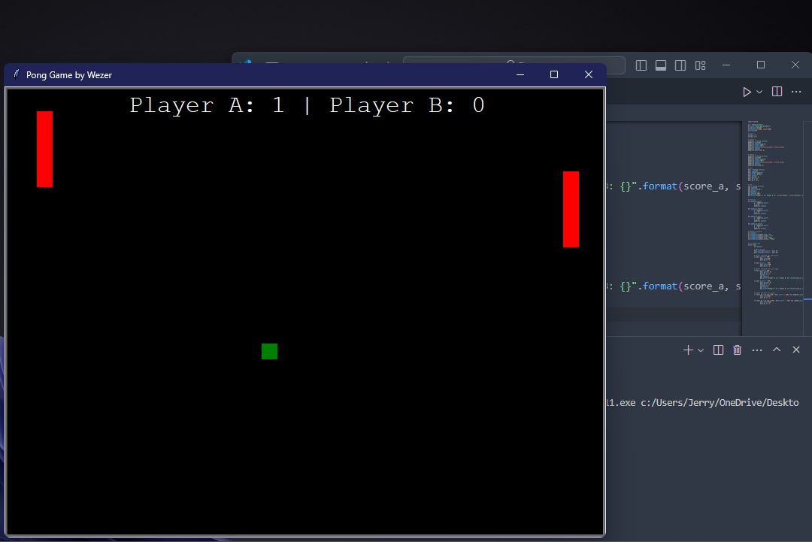

# Pong Game

Welcome to the classic Pong game implemented in Python using the Turtle module. This simple yet addictive game allows two players to compete against each other in a virtual game of table tennis.



## Features

- Two-player gameplay
- Simple controls (W/S keys for Player A, Up/Down arrow keys for Player B)
- Sound effects for ball collisions and score updates
- Score tracking for both players
- Colorful graphics using Turtle module

## Installation

### Linux

1. Clone this repository to your local machine:

   ```bash
   git clone https://github.com/yourusername/pong-game.git
   ```

2. Navigate to the project directory:

   ```bash
   cd pong-game
   ```

3. Install the required dependencies (Turtle module is included in standard Python distributions):

   ```bash
   # If you're using Python 3.x
   sudo apt-get install python3-tk
   ```

4. Run the game:

   ```bash
   python3 pong_game.py
   ```

### Windows

1. Download and install Python from the official website: [Python Downloads](https://www.python.org/downloads/)
2. Clone or download this repository to your local machine.
3. Navigate to the project directory using Command Prompt or PowerShell.
4. Run the game:

   ```cmd
   python pong_game.py
   ```

## Gameplay

- Use the `W` and `S` keys to control the paddle for Player A (left side).
- Use the `Up` and `Down` arrow keys to control the paddle for Player B (right side).
- The game ends when one player reaches a certain score (default is set to 5).

## Contributions

Contributions to the project are welcome! If you'd like to add new features, fix bugs, or improve the code, feel free to fork the repository and submit a pull request.

## Some Improvements to be made

- Add Game Over Condition:
Implement game-over condition when one player reaches a certain score. You can then reset the scores and ball position to restart the game.

- Optimize Collision Detection:
Instead of hardcoding the paddle and ball collision conditions, you could create a function to handle collisions between the paddles and the ball. This would make the code more modular and easier to maintain.

- Improve Sound Handling:
Consider loading the sound files outside of the game loop to avoid reloading them on every collision. This could improve performance, especially if the sound files are large.

- Implement AI for Single Player Mode:
If you want to make the game more dynamic, you could implement an AI-controlled paddle for single-player mode. This would allow players to enjoy the game even when they don't have a second player available.
